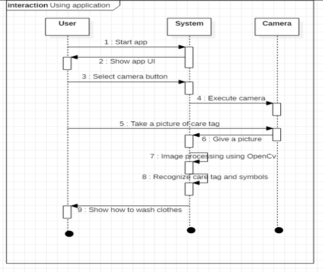
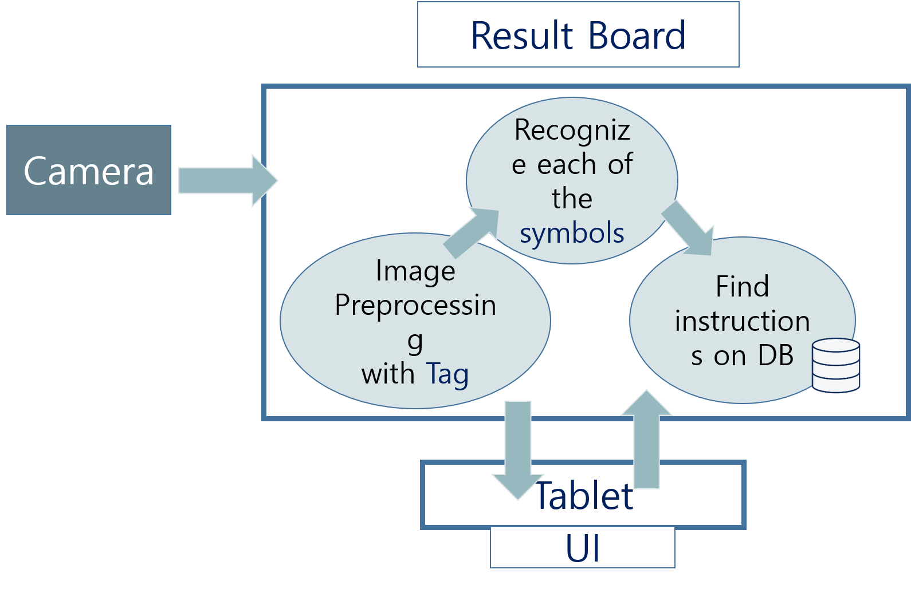
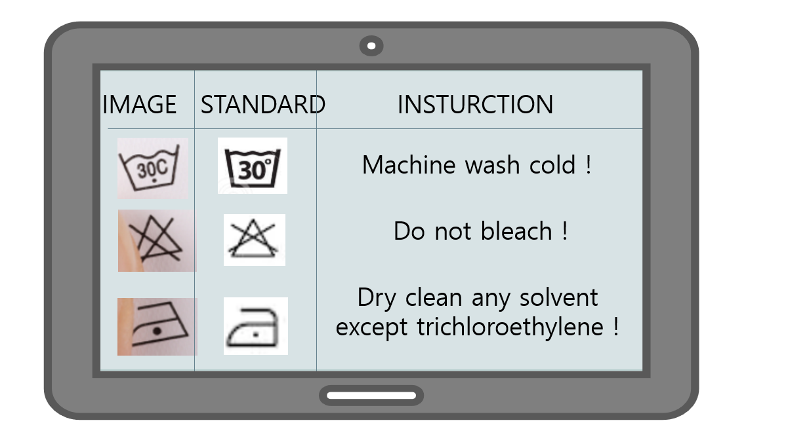
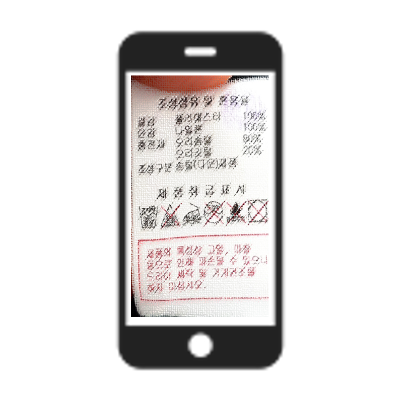
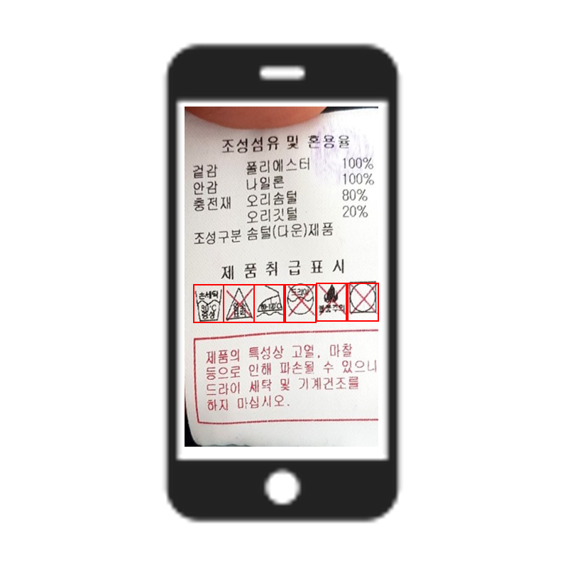

# 애지중지(愛䙙重䙙)
가천대학교 소프트웨어학과 졸업작품 2분반 
양한진, 이준수, 황병훈

### Motivation
1. Most of us do not tend to pay attention to the care symbols on the label of clothes.
2. Also, the laundry method varies according to type of clothes.
3. So we have experienced unwanted results like shrunken, being discolored or being damaged clothes by wrong laundry method.
4. This unwanted result can not be compensation by company

### System overview
In Sequence
</img>
 Structure
</img> 

### Description
This program recognize care symbols in tag by image processing and Yolo v2. 
Users can know laundry method of user's clothes easily by just taking a picture of care tag 
 
The following information can be displayed.
 

* Recognized symbols
* Standard of symbols
* informaion about symbol

</img>

</img> 
</img>
</img>

