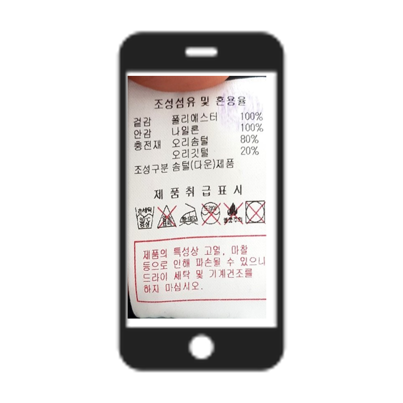

# 애지중지(愛䙙重䙙)
가천대학교 소프트웨어학과 졸업작품 2분반 
양한진, 이준수, 황병훈

### Motivation
1. Most of us do not tend to pay attention to the care symbols on the label of clothes.
2. Also, the laundry method varies according to type of clothes.
3. So we have experienced unwanted results like shrunken, being discolored or being damaged clothes by wrong laundry method.
4. This unwanted result can not be compensation by company

### Description
  Our program detect picture of care tag which user take. 
  And do image processing to detect symbols in care tag easily. 
  Then, recognize symbols using YOLO v2 and show how to wash clothes in text. 

### System overview

</img> 
</img>
</img>

### System interaction
</img>
